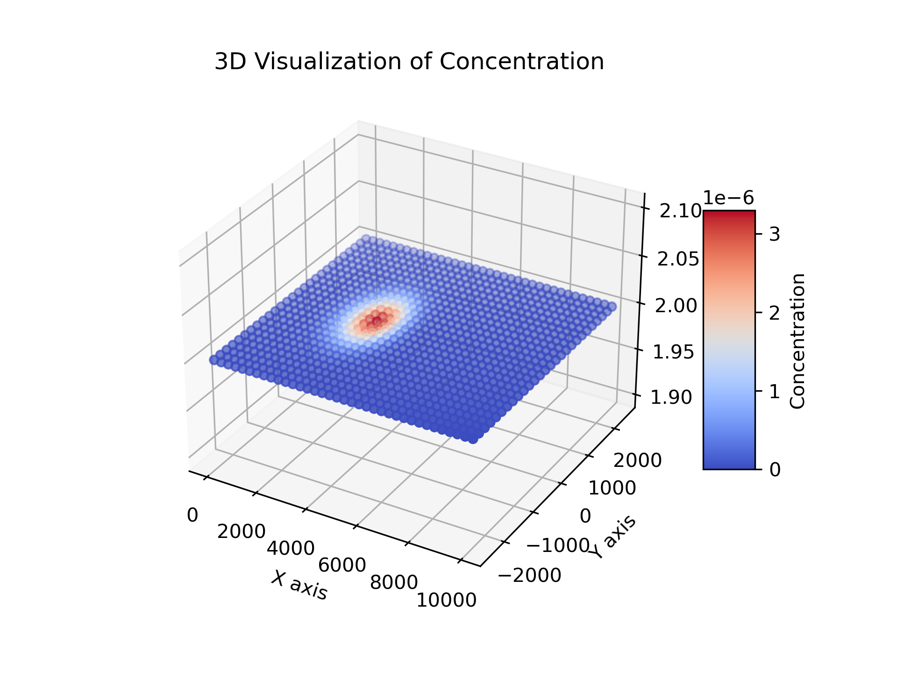

# Concentration-Flask-Timeseries

A Flask-based API to analyze and visualize data from a provided timeseries CSV file. The API provides endpoints to get the mean, standard deviation, sum, and visualization of the concentrations in the csv file. This project is deployed with Docker and requires Docker and Docker Compose to be installed.



## Assignment Overview

The requirements for this assignment were:
1. Use of a publicly hosted repository.
2. Utilization of the Flask Web Framework within Python.
3. Implementation of endpoints to fetch statistics and visualization from a CSV file.
4. Deployment using Docker.
5. A README.md.

## Prerequisites

- Git
- Docker
- Docker Compose

<!-- Make sure this works on windows and on my laptop. -->

## Getting Started

1. **Clone the repository**:
   ```bash
   git clone https://github.com/zacharykeeler/Concentration-Flask-Timeseries.git
   cd Concentration-Flask-Timeseries
   ```

2. **Run the application**:
   - Run in detached mode (background):
     ```bash
     docker-compose up -d
     ```
   - Or run in the foreground:
     ```bash
     docker-compose up
     ```


3. **Access the application**:
    Visit either http://localhost:8000/ or http://127.0.0.1:8000/ and one of the endpoints, like http://localhost:8000/get-sum, in your browser to confirm the application is running.

## API Endpoints

- **/get-sum**: Sum of concentrations.
- **/get-mean**: Mean value of concentrations.
- **/get-std-deviation**: Standard deviation of concentrations.
- **/get-image**: A PNG visualization of concentrations in a 3D plot.

## Code Structure and Design

The codebase is designed with a focus on encapsulation and separation of concerns. The goal is to achieve a modular, maintainable, and easy-to-understand structure. The separation of the application's routing and data processing logic ensures that the code remains modular. If additional data processing methods or visualization techniques need to be added, they could be easily incorporated into the Concentration class without altering the Flask application's existing routing logic in app.py.

### app.py

This file serves as the entry point for the Flask application and is primarily concerned with:

1. **Argument Handling**: It uses the argparse module to handle command-line arguments. This design choice allows users to specify a different CSV file as input which allows flexibility in the data source without changing the code. By default argparse will load concentration.timeseries.csv.
   
2. **Flask Route Setup**: All the API endpoints are defined here. Each Flask route corresponds to a method in the Concentration class from concentration.py.

3. **Initialization**: It initializes an instance of the Concentration class, which then handles the reading, analysis, and visualization of the concentration data from the provided CSV file.

### concentration.py

This file contains the Concentration class, which encapsulates all the data processing and visualization logic. The design choices in this class include:

1. **Data Loading and Validation**: Upon initialization, the class reads the data from the given CSV file using the pandas library. It also checks to ensure that the required columns are present in the CSV.

2. **Data Processing**: Methods like mean(), std_dev(), and sum() use the capabilities of pandas to calculate the respective statistics of the concentration values.

3. **Visualization**: The _create_image() private method is responsible for creating a 3D scatter plot of the concentrations using the matplotlib library. The created image is saved as a PNG file, which can be fetched via the API endpoint.

## References

- https://github.com/docker/awesome-compose/tree/master/flask
- https://matplotlib.org/stable/gallery/mplot3d/scatter3d.html
- https://matplotlib.org/stable/tutorials/colors/colormaps.html